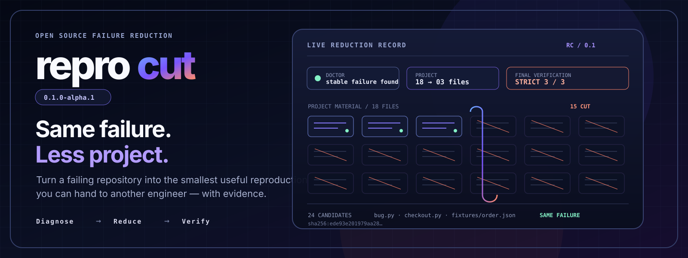
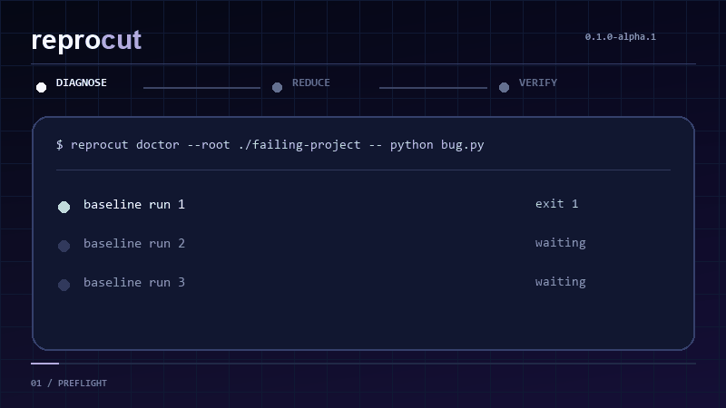

# ReproCut

Turn a failing project into the smallest project ReproCut can find that still
produces the same stabilized failure.



ReproCut does not guess from filenames or delete files in your checkout. It
proves a baseline, evaluates every candidate in a fresh copy, distinguishes a
preserved failure from a different failure, and publishes only after three
final verification runs agree.

The checked-in demo is measured, not illustrative: **18 → 3 files**, **24
candidate evaluations**, **3/3 strict final verification**, and a versioned
same-failure fingerprint. Inspect the raw [schema-4 evidence](demo/result/reduction.json),
[attempt ledger](demo/result/attempts.jsonl), or [self-contained report](demo/result/report.html).

> ReproCut 0.1 is in release-candidate development. crates.io and PyPI artifacts
> are prepared but have not been uploaded.

## Why this is more than a recursive delete loop

- hierarchical directory and subset/complement `ddmin` search to a fixpoint;
- manifest reduction for `Cargo.toml`, `pyproject.toml`, and `package.json`;
- Tree-sitter deletion/hoisting passes for Rust, Python, JavaScript, TypeScript,
  C, C++, Go, and Java, with reparsing before execution;
- stdout, stderr, or combined normalized failure identity;
- strict 3/3 mode and configurable flaky supermajority mode;
- process-tree containment on Unix and Windows with bounded concurrent pipe drains;
- deterministic parallel frontiers and an append-only SQLite resume journal;
- one evidence model for JSON, JSONL, HTML, GitHub issue Markdown, Python, and
  the editor protocol;
- optional OCI archive export and an opt-in redacted static gallery submission.

ReproCut promises a locally 1-minimal result for the transformations it explores,
not a global semantic minimum.

## Build the current release candidate

Rust 1.85 or newer is required when building from source.

```console
git clone https://github.com/emirhuseynrmx/reprocut
cd reprocut
cargo install --path crates/reprocut-cli
```

After the registries are published, the intended installs are:

```console
cargo install reprocut
python -m pip install reprocut
```

## Minimize a failure

For Cargo, Python, or npm projects, start with ecosystem discovery:

```console
reprocut minimize --root ./failing-project --output ./minimal
```

Or pass the exact failing command after `--`. ReproCut never interprets the
command's flags:

```console
reprocut reduce \
  --root ./compiler-bug \
  --output ./minimal \
  --jobs 8 \
  --timeout-ms 5000 \
  --oracle-stream auto \
  -- cargo test parser::rejects_split_utf8
```

Use `--flaky --flaky-runs 11 --flaky-required 9` when the property is genuinely
nondeterministic. An inconclusive timeout, truncated stream, preparation error,
or runner failure can never authorize a cut.

Choose the interestingness contract explicitly when automatic discriminators
are not the right tool:

```console
reprocut reduce --oracle-mode regex \
  --failure-regex 'TypeError' --failure-regex 'currency' \
  --reject-regex 'secondary failure' -- python bug.py

reprocut reduce --oracle-mode exit-zero -- cargo test generated_property
```

`automatic` is the default and intersects exact schema-5 normalized,
stream-qualified discriminators across repeated baselines. Regex mode requires
every failure expression and lets any reject expression veto a candidate.
Exit-zero mode ignores text and preserves only a successful exit.

For dependency-sensitive Python projects, isolated mode requires all inputs up
front and creates a fresh virtual environment for every candidate:

```console
python -m pip download --only-binary=:all: --dest ./wheelhouse .
reprocut minimize --root . --prepare isolated-python \
  --python-executable /usr/bin/python3 \
  --python-wheelhouse ./wheelhouse \
  --python-extra test -- python -m pytest -q
```

Pip runs with `--isolated --no-index`; user-site, indexes, Python path, and
virtual-environment variables are scrubbed. Interpreter identity, wheel bytes,
normalized extras, optional argv-only `--prepare-spec`, environment policy,
timeout, and capture budget are frozen into the preparation hash.

## What gets published

```text
minimal/
├── project/          verified retained snapshot
├── artifact-manifest.json   canonical identity of every artifact member
├── reduction.json   complete versioned evidence
├── attempts.jsonl   append-only candidate observations
├── report.html      portable report with no network dependency
├── issue.md         copy/paste GitHub issue body
├── reproduce.sh
└── reproduce.ps1
```

The source checkout remains untouched. Output is assembled in a sibling staging
directory and published by no-clobber rename; an existing file, directory, or
symlink is rejected.

## What “same failure” means

Before search, ReproCut executes the original property repeatedly. Strict mode
requires the same termination and stable normalized diagnostic anchors on all
three runs. Only context-qualified volatility is normalized: a `token:number`
is a source location only when the token is path-like or has a recognized source
extension. Semantic values such as `status:404`, `expected:123`, and `shard:12`
remain part of the failure identity. In `combined` mode at least one selected
anchor from stdout and one from stderr are mandatory.

Every candidate receives one of three verdicts:

- `preserved`: the stabilized failure was observed;
- `rejected`: the command passed or failed differently;
- `inconclusive`: the evidence was incomplete or unreliable.

Only `preserved` can replace the current winner. The final snapshot is then run
three more times before publication.

## Resume and machine integration

Interrupted searches can continue from a compatibility-checked SQLite journal:

```console
reprocut resume \
  --root ./failing-project \
  --output ./minimal-resumed \
  --state ./reprocut-state.sqlite3 \
  -- cargo test parser::case
```

Integrations use a bounded, versioned JSONL protocol instead of scraping terminal
output:

```console
reprocut protocol run --request request.json
```

0.1 integrity journals use contract schema 2. Older journals and any change to
source bytes, executable masks, argv boundaries, oracle, evaluation policy,
preparation inputs, inventory exclusions, adapter, or engine identity fail
closed; start again only with an explicit `--restart`.

The [VS Code/Cursor extension](editors/vscode/README.md) is deliberately thin:
it invokes this protocol, validates event ordering and artifact paths, and never
downloads a binary or embeds reducer logic.

## Python API

The typed Python client invokes the same Rust protocol engine:

```python
from pathlib import Path

from reprocut import ReductionRequest, reduce

result = reduce(
    ReductionRequest(
        root=Path("compiler-bug"),
        output=Path("minimal"),
        command=("cargo", "test", "parser::case"),
    )
)
print(result.fingerprint_sha256, result.report)
```

The source-checkout fallback implements oracle semantics only. Full reduction
requires the CLI/native release; Python never silently substitutes a second
reducer.

## Portable handoff

Export a completed artifact as a validated OCI image archive when Docker Buildx
or BuildKit is available:

```console
reprocut export oci --from ./minimal --output minimal.oci.tar
```

Prepare a redacted, local-only gallery directory:

```console
reprocut gallery prepare \
  --from ./minimal \
  --output ./submission \
  --title "Parser split UTF-8 failure" \
  --license "MIT"
```

No source is included unless `--include-source` is explicit, and nothing is
uploaded. Gallery pull-request CI validates the closed schema, paths, size,
license declaration, symlinks, and common credentials without executing a
submission.

## Evidence before performance claims

The release benchmark generates a deterministic 312-file failure and records
raw wall time, engine time, exact oracle runs, attempts, cache hits, before/after
files/bytes/lines, and sampled process-tree RSS:

```console
python scripts/benchmark_release.py \
  --reprocut target/release/reprocut \
  --python python \
  --output output/release-benchmark \
  --runs 5 --warmup 1
```

Hosted-runner timing is uploaded as evidence, not used as a speed claim. ReproCut
currently claims no measured speedup.

The download-only [upstream corpus](benchmarks/upstream-corpus.json) pins 24 real
GCC/Clang reduction subjects from Perses. Its GPL-3.0 material is never bundled
or executed automatically; fetching requires `--accept-gpl-3.0`.

## Verification

The repository gates formatting, Clippy, Rust contracts, docs, Python, Loom,
Miri, AddressSanitizer, dependency policy, native wheels, three operating
systems, real OCI export, editor protocol tests, gallery secret/path tests,
release archives, SBOMs, checksums, and provenance.

```console
cargo fmt --all -- --check
cargo clippy --workspace --all-targets --all-features -- -D warnings
cargo test --workspace --all-targets
PYTHONPATH=python python -m pytest python/tests -q
node --test editors/vscode/test/*.test.js
node --test gallery/test/*.test.js
```

The current Windows development host blocks the local Rust executable through
Application Control. Pure Python/Node contracts run locally; composed Rust
contracts are compiled with the official Rust Playground, and the complete
native/toolchain matrix remains the clean GitHub Actions release authority.

## Safety boundary and limits

- Candidate commands run with your user authority; ReproCut is not a hostile-code sandbox.
- Network-disabled preparation is ecosystem-specific, not a universal guarantee.
- `isolated-python` provides offline dependency isolation, not a hostile-code sandbox.
- Grammar transforms are conservative allowlists and can leave a larger result.
- “Retained” is an observed final snapshot fact, not a root-cause claim.
- Registry publication and the `v0.1.0` tag remain irreversible user actions.

The product/research rationale and acceptance contract live in the
[complete 0.1 design](docs/superpowers/specs/2026-08-11-reprocut-complete-0.1-design.md).

## License

Licensed under either Apache-2.0 or MIT, at your option.
